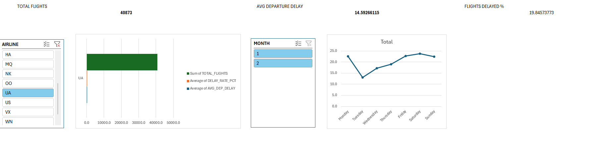

# Airline Delay Analytics & Predictive Pipeline

An end-to-end data analytics project that processes flight operational data via an ETL pipeline, builds a predictive machine learning model for delay probabilities, and exposes an interactive executive dashboard for business insights.

## Tech Stack & Architecture
- **Data Engineering:** Python (Pandas), SQL (SQLite)
- **Data Science / ML:** Scikit-Learn (Random Forest Classifier)
- **Business Intelligence:** Microsoft Excel (Power Query, Data Modeling, Pivot Charts, Slicers)

## Key Insights Discovered
- **Operational Bottlenecks:** Mondays and Fridays exhibit higher average delay patterns compared to mid-week flights.
- **Predictive Accuracy:** The Random Forest classification model predicted flight delays (>15 mins) based on Month, Day of Week, and Carrier features.

## Project Structure
- `ingest_data.py`: Python script migrating raw CSV data into a structured SQLite database.
- `eda_and_modeling.ipynb`: Jupyter notebook containing advanced SQL queries and the Machine Learning modeling pipeline.
- `Airline_Delay_Dashboard.xlsx`: Fully interactive, data-modeled Excel dashboard.